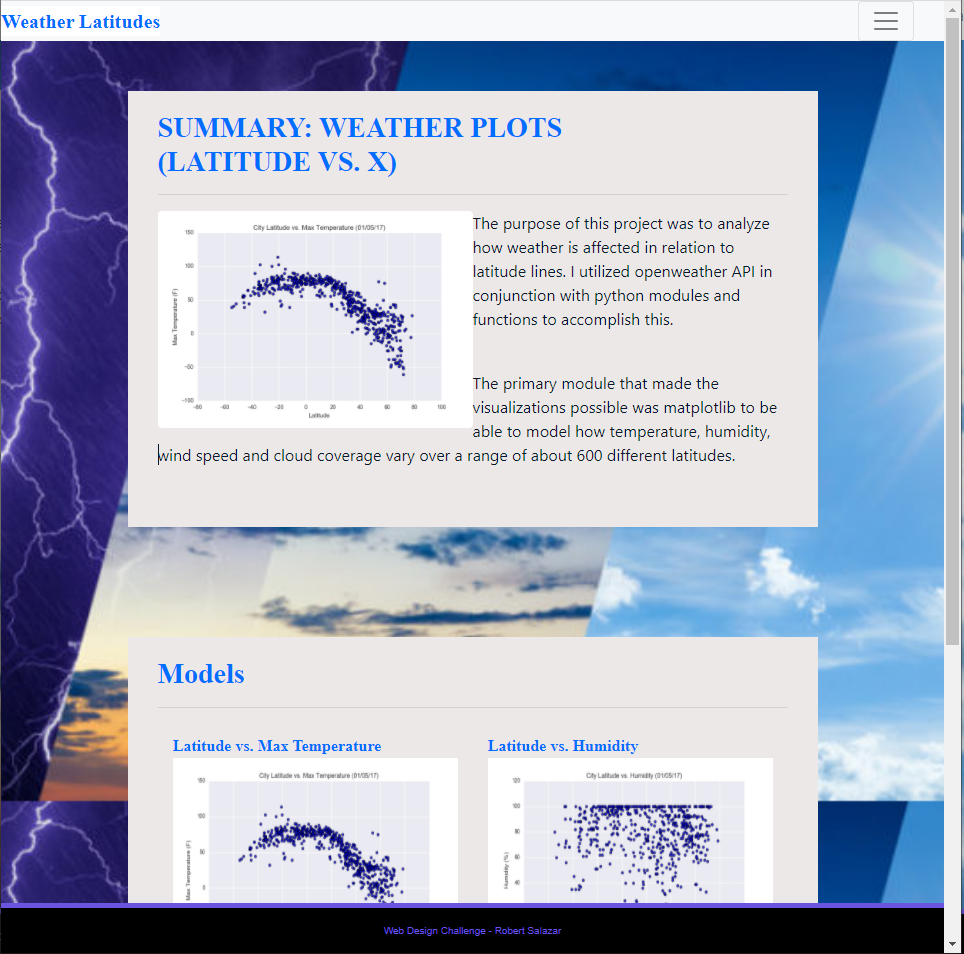
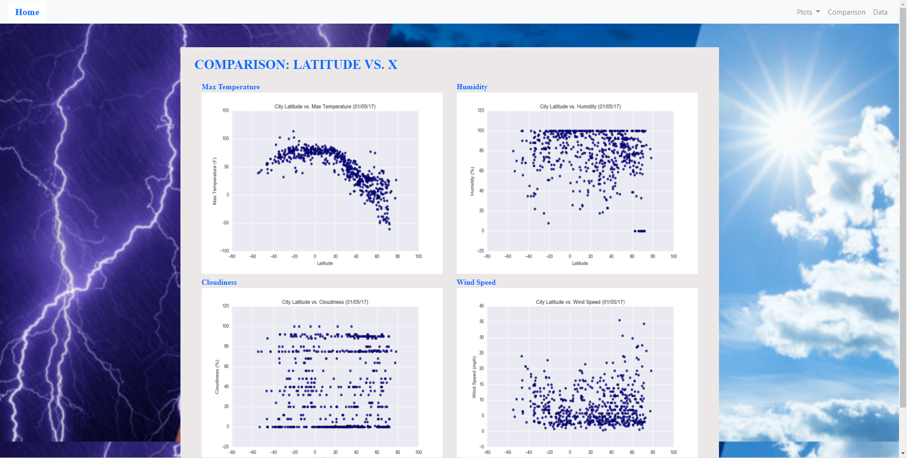
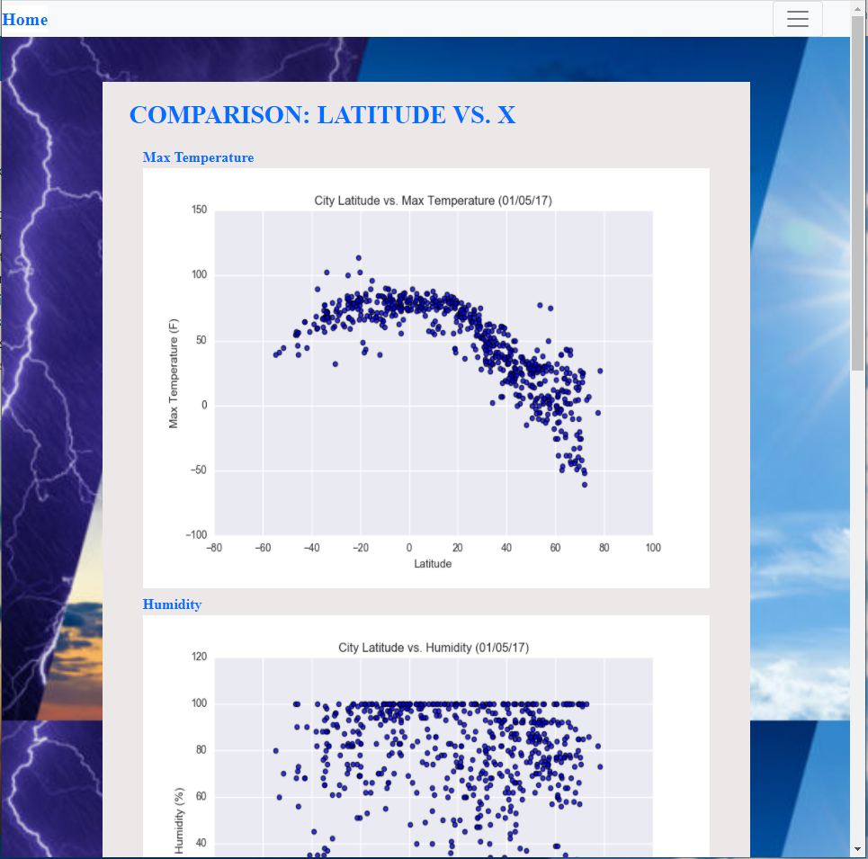
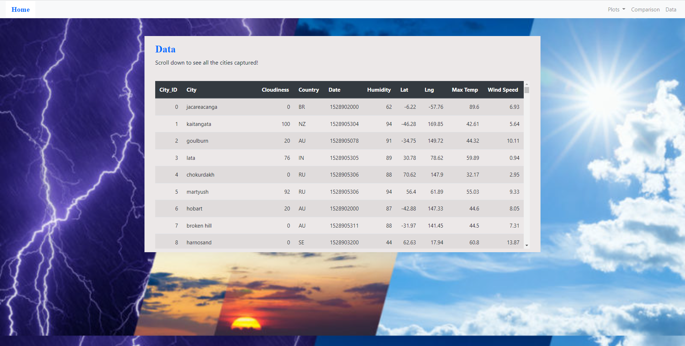
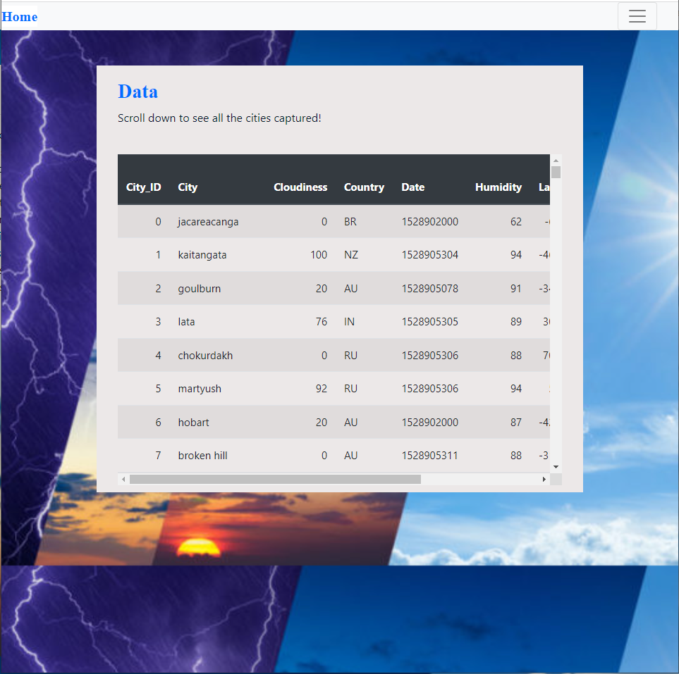
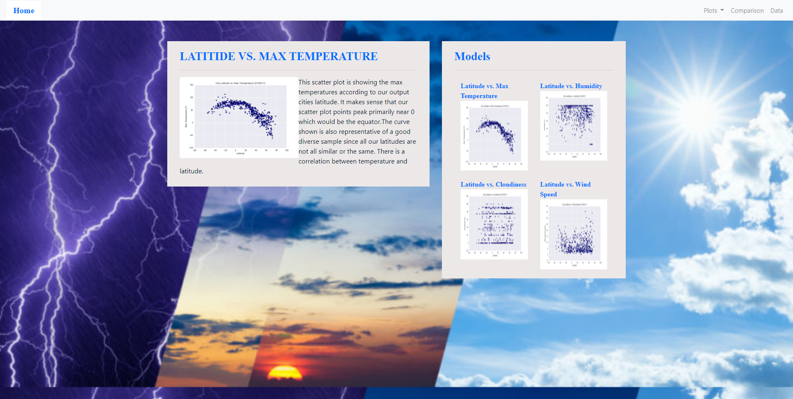
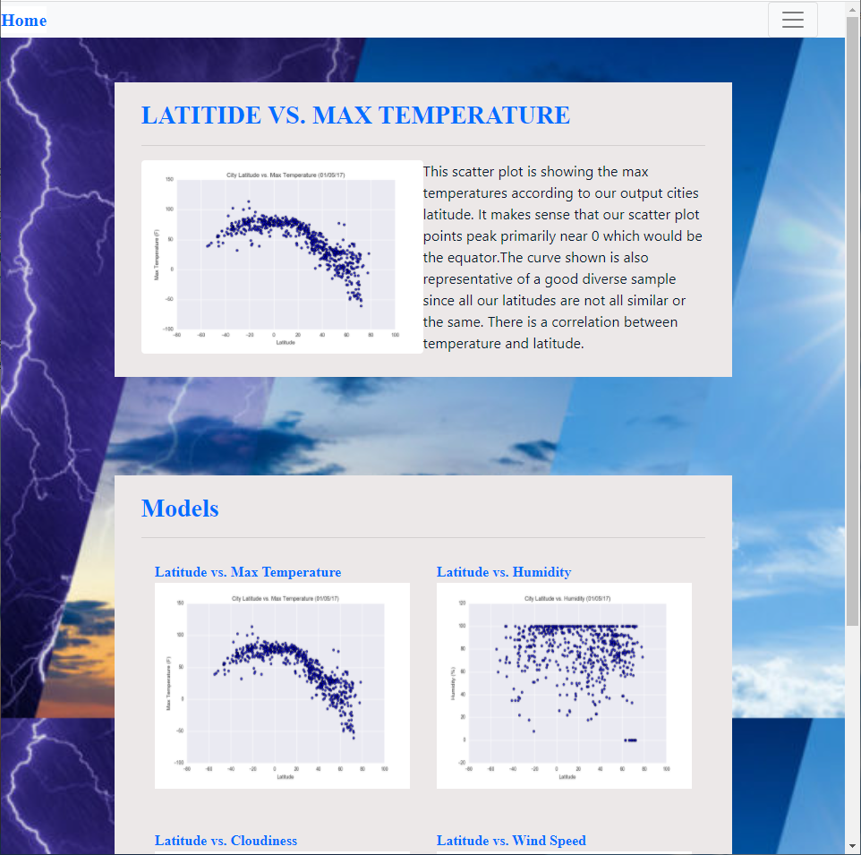
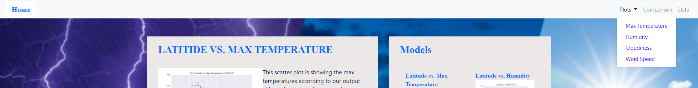

# Web Design Homework - Web Visualization Dashboard (Latitude)

## Background

Data is more powerful when we share it with others! Let's take what we've learned about HTML and CSS to create a dashboard showing off the analysis we've done.

## Latitude - Latitude Analysis Dashboard with Attitude

For this homework we'll be creating a visualization dashboard website using visualizations we've created in a past assignment. Specifically, we'll be plotting [weather data](resources/cities.csv).

In building this dashboard, we'll create individual pages for each plot and a means by which we can navigate between them. These pages will contain the visualizations and their corresponding explanations. We'll also have a landing page, a page where we can see a comparison of all of the plots, and another page where we can view the data used to build them.

### Screenshots

This section contains screenshots of each page that must be built, at varying screen widths. These are a guide; you can meet the requirements without having the pages look exactly like the below images.

#### Landing page
---

Small screen:

- - -

#### Comparisons page

Large screen:

Small screen:

- - -

#### Data page

Large screen:

Small screen:

- - -

#### Visualization pages

There are four of these, one for each visualization. Here's an example of one:

Large screen:

Small screen:

- - -

#### Navigation menu

Navigation Menu:

- - -

## References

*OpenWeatherMap.org. (2012). Сurrent weather and forecast. Retrieved from [https://openweathermap.org/](https://openweathermap.org/)
*Data provided in startup file used.
